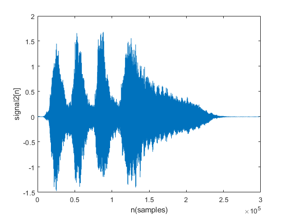
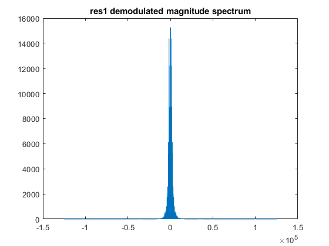
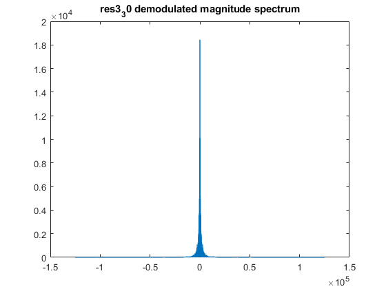
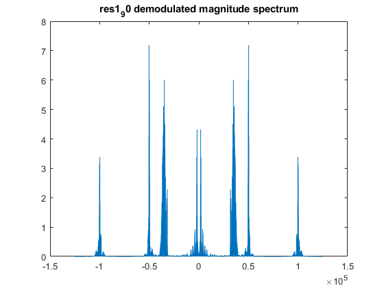

# Amplitude-Modulation
## Input signals
### Time domain

<table>
  <tr>
    <th>signal 1</th>
    <th>signal 2</th>
    <th>signal 3</th>
  </tr>
  <tr>
    <td>
      
    </td>
    <td>
      
    </td>
    <td>
      
    </td>
  </tr>
</table>

### Frequency domain

<table>
  <tr>
    <th>signal 1</th>
    <th>signal 2</th>
    <th>signal 3</th>
  </tr>
  <tr>
    <td>
      
    </td>
    <td>
      
    </td>
    <td>
      
    </td>
  </tr>
</table>

## Modulated signal
Modulating the input signals on different carriers by multiplying : 
- The first signal by cos(ω1 * t) where ω1 is an angular frequency in rad/sec
- The second signal by cos(ω2 * t) where ω2 is an angular frequency in rad/sec
- The third signal by sin(ω2 * t) where ω2 is an angular frequency in rad/sec

ω1 = 2 * M_PI * f1 where f1 = 50,000 Hz  \
ω2 = 2 * M_PI * f2 where f2 = 100,000 Hz

### Time domain

### Frequency domain

## Demodulation:
Inorder to demodulate the recieved signal at the reciever we use a synchronous carrier as follows:
- The Modulated signal is multiplied by cos(ω1 * t) where ω1 is an angular frequency in rad/sec then a low pass filter with freq = f1 is applied to restore signal 1
- The Modulated signal is multiplied by cos(ω2 * t) where ω2 is an angular frequency in rad/sec then a low pass filter with freq = f2 is applied to restore the second signal
- The Modulated signal is multiplied by sin(ω2 * t) where ω2 is an angular frequency in rad/sec then a low pass filter with freq = f2 is applied to restore the third signal

ω1 = 2 * M_PI * f1 where f1 = 50,000 Hz  \
ω2 = 2 * M_PI * f2 where f2 = 100,000 Hz

<table>
  <tr>
    <th>signal 1</th>
    <th>signal 2</th>
    <th>signal 3</th>
  </tr>
  <tr>
    <td>
      
    </td>
    <td>
      
    </td>
    <td>
      
    </td>
  </tr>
</table>

## Disadvantages of using a synchronous carrier
Using a synchronous carrier may cause attenuation or noise to the recieved signal if the local carrier in the reciever is not synchronized with the recieved signal carrier. This is tested by applying a phase shift of 10, 30 and 90 to the local carrier used in modulation

### In case of phase shift = 10:
- Signal 1 is subject to very little attenuation
- Signals 2 & 3 interfere slightly

<table>
  <tr>
    <th>demodulated signal 1</th>
    <th>demodulated signal 2</th>
    <th>demodulated signal 3</th>
  </tr>
  <tr>
    <td>
      
    </td>
    <td>
      
    </td>
    <td>
      
    </td>
  </tr>
</table>

### In case of phase shift = 30:
- Signal 1 is subject to more attentuation
- Signals 2 & 3 interfere more with each other

<table>
  <tr>
    <th>demodulated signal 1</th>
    <th>demodulated signal 2</th>
    <th>demodulated signal 3</th>
  </tr>
  <tr>
    <td>
      
    </td>
    <td>
      
    </td>
    <td>
      
    </td>
  </tr>
</table>

### In case of phase shift = 90:
- Signal 1 is completely attenuated
- Signals 2 & 3 are interchanged where signal 2 is resotred when demodulating to restore signal 3 & vice versa.

<table>
  <tr>
    <th>demodulated signal 1</th>
    <th>demodulated signal 2</th>
    <th>demodulated signal 3</th>
  </tr>
  <tr>
    <td>
      
    </td>
    <td>
      
    </td>
    <td>
      
    </td>
  </tr>
</table>

## Contributers : 
- [Mahmoud Gody](https://github.com/Moodrammer)
- [Hossam Alaa](https://github.com/hossamalaa69)

